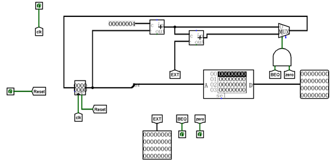
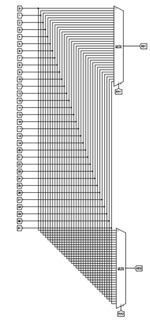
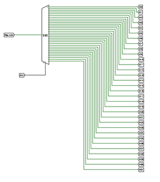
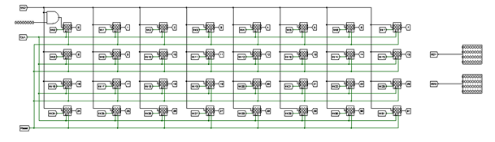
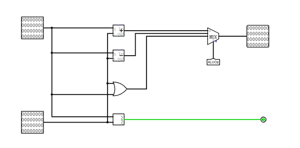
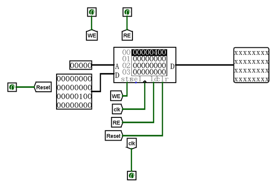
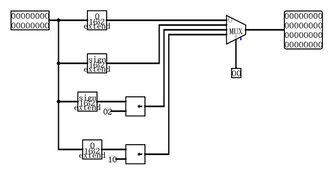
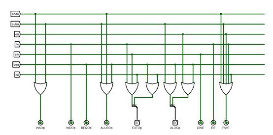

**单周期cpu设计文档**

王郁含 16182672

## 一、    设计与测试说明

1）处理器为32位处理器。

2）处理器应支持的指令集为：{addu, subu, ori, lw, sw, beq, lui, nop}。

3）nop机器码为0x00000000， 即空指令，不进行任何有效行为（修改寄存器等）

4）addu,subu可以不支持溢出。

5）处理器为单周期设计。

6）需要采用模块化和层次化设计。顶层有效的驱动信号要求包括且仅包括：reset (clk 请使用内置时钟模块).

7）需自行构造测试集，验证设计的正确性。

 

## 二、    CPU设计文档

### 1)       模块规格设计

- #### IFU（取指令单元）：

l   内部包括 PC（程序计数器）、IM(指令存储器)及相关逻辑。

l   PC 用寄存器实现，应具有复位功能。

l   起始地址：0x00000000。

l   IM用 ROM 实现，容量为 32bit * 32。

l   因 IM 实际地址宽度仅为 5 位，故需要使用恰当的方法将 PC 中储存的地址同 IM 联系起来。

​                                                  

- #### GRF（通用寄存器组，也称为寄存器文件、寄存器堆）

l   用具有写使能的寄存器实现，寄存器总数为 32 个。

l   0 号寄存器的值始终保持为 0。其他寄存器初始值均为 0，无需专门设置。

 

   

 

- #### ALU（算术逻辑单元）

l   提供 32 位加、减、或运算及大小比较功能。

l   可以不支持溢出（不检测溢出）。

   

- #### DM（数据存储器）

l   使用 RAM 实现，容量为 32bit * 32。

l   起始地址：0x00000000。

l   RAM 应使用双端口模式，即设置 RAM 的 Data Interface 属性为 Separate load and store ports。

   

EXT

l   可以使用 logisim 内置的 Bit Extender。

2)       数据通路设计

| 指令  | Adder | PC   | IM.A        | GRF  | ALU  | DM   | EXT  | Nadd  |        |        |      |        |       |       |      |
| ----- | ----- | ---- | ----------- | ---- | ---- | ---- | ---- | ----- | ------ | ------ | ---- | ------ | ----- | ----- | ---- |
| A     | B     | RA1  | RA2         | WA   | WD   | A    | B    | Add.  | Wdata  | A      | B    |        |       |       |      |
| R类型 | PC    | 4    | Adder       | PC   | Rs   | Rt   | Rd   | ALU   | RF.RD1 | RF.RD2 |      |        |       |       |      |
| ORI   | PC    | 4    | Adder       | PC   | Rs   |      | Rt   | ALU   | RF.RD1 | EXT    |      |        | Imm16 |       |      |
| LW    | PC    | 4    | Adder       | PC   | Rs   |      | Rt   | DM.RD | RF.RD1 | EXT    | ALU  |        | Imm16 |       |      |
| SW    | PC    | 4    | Adder       | PC   | Rs   | Rt   |      |       | RF.RD1 | EXT    | ALU  | RF.RD2 | Imm16 |       |      |
| BEQ   | PC    | 4    | Adder\|Nadd | PC   | Rs   | Rt   |      |       | RF.RD1 | RF.RD2 |      |        | Imm16 | Adder | EXT  |
| LUI   | PC    | 4    | Adder       | PC   | Rs   |      | Rt   | ALU   | RF.RD1 | EXT    |      |        | Imm16 |       |      |

注：Rs:IM.A[25:21] 

   	 Rt:IM.A[20:16]

​		Rd:IM.A[15:11]

3)       控制器设计

| **func** | **100001** | **100011** | **n/a** |        |        |        |        |
| -------- | ---------- | ---------- | ------- | ------ | ------ | ------ | ------ |
| op       | 000000     | 000000     | 001101  | 100011 | 101011 | 000100 | 001111 |
| 指令     | addu       | subu       | ori     | lw     | sw     | beq    | lui    |
| WAOp     | 1          | 1          | 0       | 0      | x      | x      | 0      |
| WDOp     | 0          | 0          | 0       | 1      | x      | x      | 0      |
| BEQOp    | 0          | 0          | 0       | 0      | 0      | 1      | 0      |
| ALUBOp   | 1          | 1          | 0       | 0      | 0      | 1      | 0      |
| EXTOp    | x          | x          | 00      | 01     | 01     | 10     | 11     |
| RWE      | 1          | 1          | 1       | 1      | 0      | 0      | 1      |
| DWE      | 0          | 0          | 0       | 0      | 1      | 0      | 0      |
| RE       | 0          | 0          | 0       | 1      | 0      | 0      | 0      |
| ALUOP    | Add00      | Subtract01 | Or10    | Add00  | Add00  | Cmp11  | Add00  |

   

图8 与逻辑设计控制信号

   

4)       测试程序设计

1. Addu指令

| **指令**        | **16****进制代码** | **预期输出**  |
| --------------- | ------------------ | ------------- |
| addu $1, $2, $3 | 00430281           | $1 <= $2 + $3 |
| addu $4, $5, $6 | 00a60021           | $4 <= $5 + $6 |
| addu $0, $4, $5 | 00850021           | $0 <= 0       |
| addu $6, $0, $7 | 00073021           | $6 <= $7      |
| addu $8, $9, $0 | 01204021           | $8 <= $9      |

2. Subu指令

| **指令**        | 16进制代码 | **预期输出**                | **说明**                     |
| --------------- | ---------- | --------------------------- | ---------------------------- |
| subu $1, $2, $3 | 00430823   | $1 <= $2 - $3               | 正常情况1：无溢出            |
| subu $4, $5, $6 | 00a62023   | $4 <= $5 - $6 + 0x100000000 | 正常情况2：有溢出            |
| subu $0, $4, $5 | 00850023   | $0 <= 0                     | 特殊情况1：存入0号寄存器     |
| subu $6, $0, $7 | 00073023   | $6 <= 0x100000000 - $7      | 特殊情况2：0号寄存器为被减数 |

3. Ori指令

| **指令**        | **16****进制代码** | **预期输出**           | **说明**                        |
| --------------- | ------------------ | ---------------------- | ------------------------------- |
| ori $1, $2, 100 | 34410064           | $1 <= $2 \| 0x00000064 | 正常情况                        |
| ori $0, $3, 200 | 346000c8           | $0 <= 0                | 特殊情况1：存入0号寄存器        |
| ori $4, $0, 300 | 3404012c           | $4 <= 0x0000012c       | 特殊情况2：0号寄存器为操作数    |
| ori $5, $6, 0   | 34c50000           | $5 <= $6               | 特殊情况2：立即数为0            |
| ori $7, $0, 0   | 34070000           | $7 <= 0                | 特殊情况3：操作数为0和0号寄存器 |

4. Lw指令

| **指令**     | **16****进制代码** | **预期输出**                            | **说明**                |
| ------------ | ------------------ | --------------------------------------- | ----------------------- |
| lw $1, 4($2) | 8c410004           | 将DM从4开始向后数$2个数据的数放入到$1中 | 正常情况                |
| lw $0, 6($3) | 8c600006           | $0 <= 0                                 | 特殊情况：写入0号寄存器 |

5. Sw指令

| **指令**     | **16****进制代码** | **预期输出**                          | **说明** |
| ------------ | ------------------ | ------------------------------------- | -------- |
| sw $1, 4($2) | ac410004           | 将$1中的数放入到DM从4开始向后数$2个中 | 正常情况 |

6. Beq指令

| **指令**                       | **16****进制代码**  | **预期输出**               | **说明**                |
| ------------------------------ | ------------------- | -------------------------- | ----------------------- |
| beq $0, $0, 1                  | 10000001            | 跳转至下下条指令           | 正常情况1：相等时正跳转 |
| addi $1, $0, 1   beq $1, $0, 4 | 20210001   1020fffe | 不跳转，继续执行下一条指令 | 正常情况2：不相等       |
| beq $0, $0, -2                 | 1000fffd            | 跳转至上上条指令           | 正常情况3：相等时负跳转 |

7. Lui指令

| **指令**      | **16****进制代码** | **预期输出**     | **说明**                 |
| ------------- | ------------------ | ---------------- | ------------------------ |
| lui $1, 100   | 3c010064           | $1 <= 0x00640000 | 正常情况                 |
| lui   $0, 200 | 3c0000c8           | $0 <= 0          | 特殊情况1：存入0号寄存器 |
| lui $2, 0     | 3c020000           | $2 <= 0          | 特殊情况2：将0加载至高位 |

8. Nop指令

| **指令** | **16****进制代码** | **预期输出** |
| -------- | ------------------ | :----------: |
| nop      | 0x00000000         |      无      |

 

